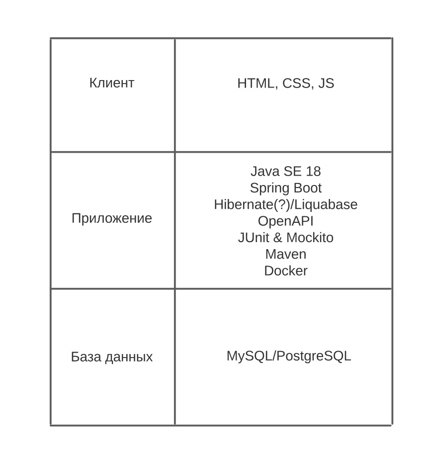
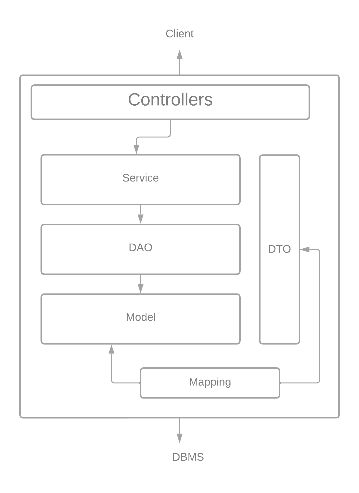

# Итоговое задание
Архитектура системы трехзвенная:

Архитектура приложения многомодульная:

Описание каждого из модулей(слоёв):
1) Model - это слой с сущностями из базы данных
2) DAO(Data Access Object) - это слой, позволяющий производить на базой данных CRUD операции. Использует слой Model;
3) Service - это слой, который вводит бизнес-логику над слоем DAO. Позже будет использоваться контроллерами;
4) DTO(Data Transfer Object) - это слой с сущностями из слоя Model с урезанным списком атрибутов. Необходим из соображений безопасности, потому что такие сущности используются контроллерами для вывода пользователю;
5) Mapping - это слой, который сопоставляет сущности из слоя DTO в слой Model и обратно;
6) Controllers - это слой, обрабатывающий запросы пользователя по протоколу HTTP. Взаимодействует со слоем Service, DTO и с клиентом.

