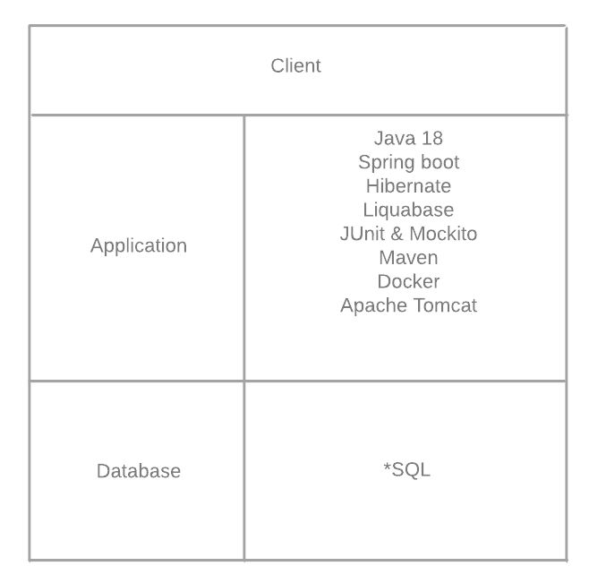
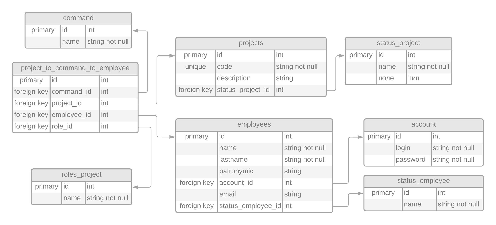

# Итоговое задание
Архитектура системы трехзвенная:

Архитектура приложения многомодульная:

Описание каждого из модулей(слоёв):
1) Model - это слой с сущностями из базы данных
2) DAO(Data Access Object) - это слой, позволяющий производить на базой данных CRUD операции([ссылка][1]). Использует слой Model;
3) Service - это слой, который вводит бизнес-логику над слоем DAO. Позже будет использоваться контроллерами;
4) DTO(Data Transfer Object) - это слой с сущностями из слоя Model с урезанным списком атрибутов([ссылка][2]). Используется всеми модулями. Необходим из соображений безопасности, потому что такие сущности используются контроллерами для вывода пользователю;
5) Mapping - это слой, который сопоставляет сущности из слоя DTO в слой Model и обратно;
6) Controllers - это слой, обрабатывающий запросы пользователя по протоколу HTTP. Взаимодействует со слоем Service, DTO и с клиентом.

## Декомпозиция задания
0) Определить архитектуру системы и приложения. Подумать над технологиями разработки в зависимости от команды и задания;
1) База данных:
   1) Спроектировать базу данных:
      1) Определить сущности и их атрибуты:
         - сотрудник
         - проект
         - команда проекта
         - задача
         Все атрибуты сущностей возьму из описания задания.
      2) Установить зависимости между сущностями:
         Связь команда-проект-сотрудник
         ...
      3) Нормализация;
         (*)Результат:
      
   2) (?) Создание дополнительных объектов: представлений, хранимых процедур;
   3) (?) Создание пользователей базы. Подумать над правами пользователей;
2) Бизнес-логика:
   1) Добавить зависимости: JDBC и ORM;
   2) Создать слой Model:
      1) Создать POJO. За основу брать таблицы из пункта 1;
      2) Установить связи между классами;
   3) Создать DAO или репозиторий. Сущность должна будет реализовывать CRUD операции над базой;
   4) Создать сервис-классы, которые будут накладывать дополнительные ограничения на выполнение операций с DAO/repository или же добавлять функционал в соответствие с требованиями, описанными в задании;
   5) Написать юниты, которые будут проверять соответствие результата работы логики с требованиями описанными в задании;
   6) Покрыть логами;
3) DTO
4) Mapping
5) Контроллеры
6) Тесты
7) Документация

[//]: # (Ресурсы)
[1]: https://colin-but.medium.com/dao-pattern-explained-895b65436f1c
[2]: https://blog.devgenius.io/dissecting-the-dto-pattern-ac3e54d0e4c8